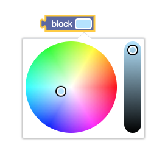
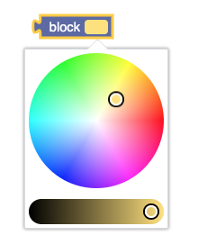

# blockly-field-color-wheel [](https://github.com/google/blockly)

This is a blockly color picker / wheel that uses the [IRO Color Picker](https://github.com/jaames/iro.js).  This field will return a hex value, but you can configure it to return whatever format you want.  





## Installation

### Yarn
```
yarn add blockly-field-color-picker
```

### npm
```
npm install blockly-field-color-picker --save
```

## Usage

For the options you don't have to pass anything in.  It will default to 
#FF00FF for the color and 150 for the width.

You can control the starting color by passing in the a hex value.  You can control the width by passing in a number for the second value.   You can over ride any of the default options by passing in a ColorPickerProps.  Read [IRO Color Pickers Docs](https://github.com/jaames/iro.js?ref=devawesome.io#color-picker-options) to learn more. 

### JavaScript
```js
import * as Blockly from 'blockly';
import {ColorPickerField} from 'blockly-field-color-picker';
Blockly.Blocks["color_picker"] = {
  init: function () {
    this.appendDummyInput()
      .appendField("template: ")
      .appendField(new ColorPickerField("#00FF00", 150, {
        layoutDirection: 'horizontal',
      }), "COLOR")
  }
};
```
### JSON

```js
import * as Blockly from 'blockly';
import 'blockly-field-color-picker';
Blockly.defineBlocksWithJsonArray([
    {
        "type": "color_picker",
        "message0": "template: %1",
        "args0": [
            {
                "type": "field_template",
                "name": "COLOR",
                "color": "#FF00FF",
                "width" : 150,
                "options":{
                    layoutDirection: 'horizontal',
                }
            }
        ]
    }]);
```

## License

Apache 2.0
